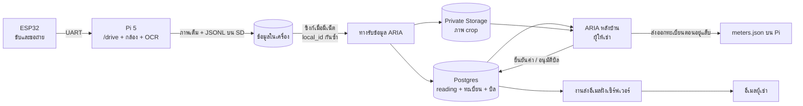

# ARIA หลังบ้านหอพัก — แบบออกแบบ v1

**วันที่:** 17 กันยายน 2569  
**สถานะ:** ข้อเสนอเพื่อทบทวน ยังไม่ใช่ระบบที่ติดตั้งแล้ว; ปรับตามคำตอบผู้ใช้ 17 ก.ย. 2569  
**ขอบเขต:** อาคารเดียว, อ่านมิเตอร์น้ำและไฟ, ผู้ให้เช่ายืนยันค่า, ออกบิลและส่งอีเมล; ค่าเช่าเป็นรายการเสริม  
**ภาพอ้างอิง:** [mockup ARIA 5 หน้า](https://claude.ai/artifact/MoAo4Pc5S5fixiqzkgUkUA) และ [โลโก้ ARIA ที่ผู้ใช้แนบ](aria-logo-reference.png)
**ต้นแบบที่เปิดดูได้:** [ARIA 10 ห้อง](aria-prototype/index.html) — ข้อมูลสมมติทั้งหมด ไม่มีการเชื่อมต่อหรือส่งอีเมลจริง

## 1. สิ่งที่อ่านจากประวัติโครงการ

| ส่วน | สถานะที่ตรวจจาก repo | หลักฐาน |
|---|---|---|
| ESP32 ↔ Pi 5 | โปรโตคอล `CAPTURE_REQ`/`$K`, คำสั่งขับเอง และ telemetry มีโค้ดและบันทึกการทดสอบบนสายจริง | `src/robot/`, `11_pi5_vision/src/capture_daemon.py`, Git `d24afca`, `ac19408`, `791dc61` |
| Pi 5 | บันทึกภาพต้นฉบับก่อน OCR, เขียน `readings.jsonl`, เว็บ `/drive`, `/api/status`, `/api/readings`; service เริ่มเองหลังบูตตามผลทดสอบใน README | `11_pi5_vision/src/{meter_reader.py,mrc_web.py}`, `11_pi5_vision/README.md`, Git `dd6e142` |
| ซิงก์คลาวด์ | มีสคริปต์รันมือ ส่ง 8 ฟิลด์แบบ upsert ตาม `local_id`; ยังไม่ส่ง `meter_id`, crop หรือประวัติยืนยัน | `11_pi5_vision/src/sync_supabase.py` |
| ARIA หลังบ้าน | มี mockup และผังข้อมูล แต่ยังไม่มีเว็บหลังบ้าน, ทะเบียนมิเตอร์, บิล หรือระบบส่งอีเมลในโค้ด | `01_เอกสารโครงการ/data_flow_หุ่นถึงแดชบอร์ด.md`, `08_การคำนวณ/10_ประเด็นค้างและความขัดแย้ง.md` §C23 |

**ระดับความมั่นใจ:** ตารางข้างบนบอกสถานะ *ตามโค้ดและบันทึกการทดสอบ* ไม่ได้แปลว่า OCR กับมิเตอร์จริง, การขับหุ่นเต็มชุด, หรือการส่งบิลจริงผ่านการทดสอบแล้ว ผู้ใช้กำหนดให้ต้นแบบมี **10 ห้อง ห้องละมิเตอร์น้ำและไฟ**; จำนวน 48 ห้องใน mockup เดิมเป็นตัวอย่าง ไม่ใช่จำนวนห้องจริง (§20.6 V10–V11)

การตัดสินใจเดิมที่แบบนี้ยึดตาม: **แยกเว็บควบคุมบน Pi กับ ARIA บนคลาวด์** ใช้ข้อมูลมิเตอร์ร่วมกัน; Pi เก็บข้อมูลก่อนแล้วค่อยซิงก์; ภาพเต็มอยู่บน Pi และส่งเฉพาะ crop ขึ้นคลาวด์; ผู้ให้เช่าต้องยืนยันค่าก่อนส่งบิล (C23 และไฟล์ 20)

## 2. เป้าหมายและขอบเขต v1

ผู้ให้เช่าเปิด ARIA แล้วตอบได้ทันทีว่า **รอบนี้อ่านครบหรือยัง, ค่าไหนต้องตรวจ, ห้องไหนออกบิลได้, ส่งอีเมลแล้วกี่ฉบับ** โดยกดเข้าจัดการรายการที่ค้างได้จากหน้าหลัก

**ข้อมูลตัวอย่างของต้นแบบ:** ห้อง 101–110 รวม 10 ห้องและ 20 มิเตอร์; มีทั้งค่าปกติ ค่า OCR ไม่มั่นใจ ห้องยังไม่อ่าน ห้องว่าง และผู้เช่าที่ไม่มีอีเมล เพื่อดูพฤติกรรมแต่ละสถานะก่อนเชื่อมข้อมูลจริง ข้อมูลตัวอย่างต้องมีป้าย “Demo” ทุกหน้าและไม่ถูกส่งขึ้นคลาวด์

เมนูหลักใช้ 5 หน้าเดิมจาก mockup:

1. **หน้าหลัก** — สถานะรอบบิลและรายการที่ต้องทำ
2. **ยืนยันค่ามิเตอร์** — เทียบรูป/OCR/ค่างวดก่อน แล้วบันทึกคำตัดสิน
3. **บิล** — ตรวจตัวอย่าง, อนุมัติ, ส่ง, ดูผลส่ง
4. **ห้องและมิเตอร์** — ทะเบียนห้อง ผู้เช่า และตัวมิเตอร์
5. **ตั้งค่า** — อัตราพร้อมวันมีผล, วันตัดรอบ, ผู้ส่งอีเมล, พื้นที่รูป

เก็บข้อมูลรอบวิ่งและสุขภาพการซิงก์ไว้เป็นแผงในหน้าหลักหรือ drawer รายละเอียด ไม่ต้องมีหน้าใหม่ใน v1 เพราะ Pi มี cockpit `/drive` สำหรับขับหุ่นอยู่แล้ว ARIA แสดงสถานะและข้อมูลที่ซิงก์มา ไม่ส่งคำสั่งขับผ่านคลาวด์

ฟีเจอร์สัญญาเช่า แจ้งซ่อม แชต รายรับรวม และพอร์ทัลผู้เช่าอยู่นอก v1 ตามเป้าหมายอ่านมิเตอร์ → ยืนยัน → บิล

## 3. โครงระบบ

- **Pi เป็นเจ้าของข้อเท็จจริงจากหุ่น:** ภาพต้นฉบับ, OCR, confidence, เวลาถ่าย, `local_id` บันทึกลงเครื่องก่อนเสมอ ห้ามให้การถ่ายรออินเทอร์เน็ต
- **ARIA เป็นเจ้าของข้อมูลธุรกิจ:** ห้อง ผู้เช่า อัตรา รอบบิล การยืนยัน และผลส่งอีเมล
- **การซิงก์เป็นขาเดียวจาก Pi ไปคลาวด์:** ส่งเฉพาะผลที่หุ่นเห็น การแก้ OCR เป็นเหตุการณ์ใหม่ที่ ARIA ไม่ย้อนทับไฟล์ใน Pi; ทะเบียนมิเตอร์ส่งกลับ Pi เป็นไฟล์ที่เจ้าของอัปเดตเมื่ออยู่แล็บตามแบบเดิม
- **รูปเต็ม:** `image_path` ในฐานข้อมูลหมายถึง path บน Pi ไม่ใช่ URL ที่เว็บคลาวด์เปิดได้ แสดง crop ที่คลาวด์; ปุ่มดูรูปเต็มใช้งานได้เมื่อเครื่องผู้ใช้เข้าถึง Pi ในเครือข่ายเดียวกันเท่านั้น

## 4. หน้าจอและพฤติกรรม

### 4.1 หน้าหลัก

ส่วนหัว: ชื่อหอ, รอบบิล, เวลาซิงก์ล่าสุด, สถานะ Pi ที่ทราบล่าสุดพร้อมคำว่า **“ข้อมูลล่าสุดเมื่อ …”** ห้ามทำให้ดูเหมือนออนไลน์สดเมื่อ Pi ไม่ได้ต่ออยู่

การ์ดหลัก 4 ใบ: **ห้องที่อ่านครบ / ห้องทั้งหมด**, **ค่ามิเตอร์รอยืนยัน**, **บิลพร้อมตรวจ/ส่ง**, **อีเมลส่งสำเร็จ/ล้มเหลว** แยกหน่วย “ค่า”, “ห้อง”, “บิล”, “ฉบับ” ชัดเจน ตัวเลขทั้งหมดต้องคำนวณจากฐานข้อมูลตามรอบที่เลือก ห้ามฝังค่า 48/21/17 จาก mockup

รายการ “ต้องดูก่อน” เรียง: มิเตอร์ที่ผูกห้องไม่ได้ → ค่าใหม่ต่ำกว่ายืนยันครั้งก่อน → ไม่มีค่าฐานงวดก่อน → OCR ไม่มั่นใจ → ยังไม่ได้อ่าน → ไม่มีอีเมล → ส่งอีเมลล้มเหลว แต่ละรายการกดไปหน้าที่แก้ได้จริง

แผง “จากหุ่น” แสดงเวลาถ่ายล่าสุด, จำนวนรายการรอซิงก์ที่ Pi รายงานล่าสุด, จำนวน crop ที่ยังไม่ถึงคลาวด์ และปุ่มไป `/drive` เฉพาะเมื่อเปิด Pi จากเครือข่ายเดียวกันได้

### 4.2 ยืนยันค่ามิเตอร์

ซ้ายเป็นคิวตามความเสี่ยงพร้อมค้นหาห้อง/`meter_id`; ขวาเป็น **crop ขนาดใหญ่**, ปุ่มรูปเต็มถ้าเข้าถึง Pi ได้, ค่า OCR ดิบ, confidence, ค่าที่ยืนยันงวดก่อน, ค่าที่จะยืนยัน, ผลต่างหน่วย และประวัติทุกครั้งที่ถ่ายหรือแก้

ปุ่ม: **ยืนยันค่า**, **ปฏิเสธ/ขอถ่ายใหม่**, **ข้าม** ผู้ใช้แก้ตัวเลขได้แต่ต้องระบุเหตุผลเมื่อแก้จาก OCR หรือยืนยันรายการผิดปกติ หลังบันทึกให้เพิ่ม `reading_event` ใหม่ ไม่แก้ `value` ของ OCR เดิม

ระบบต้องไม่ยืนยันค่าใหม่ที่ต่ำกว่าค่ายืนยันก่อนหน้าของ *มิเตอร์ตัวเดิม* การเปลี่ยนตัวมิเตอร์ใช้ขั้นตอนแยกที่บันทึกค่าสุดท้ายของตัวเก่าและค่าเริ่มของตัวใหม่ ถ้ารูปยังไม่ขึ้นคลาวด์ให้แสดง “รูปกำลังซิงก์” และพักการยืนยันที่ต้องอาศัยหลักฐานรูปไว้ก่อน

ตอนกดถ่ายบน Pi ให้ตรึง `meter_id` ที่เลือก **ณ เวลารับคำสั่งถ่าย** ไว้กับ `local_id` เดียวกัน แม้คนขับเปลี่ยน dropdown ระหว่าง OCR ทำงาน เพื่อไม่ให้รูปของห้องหนึ่งไปติดชื่ออีกห้อง

### 4.3 บิล

ตารางหนึ่งแถวต่อ **ห้อง × รอบบิล** แสดงค่าฐานและค่าปัจจุบันของน้ำ/ไฟ, หน่วยใช้, อัตราที่มีผลในรอบนั้น, ยอดรวม, ผู้รับ, สถานะบิล และสถานะส่ง แยกตัวกรอง “ข้อมูลไม่ครบ”, “พร้อมตรวจ”, “อนุมัติแล้ว”, “ส่งแล้ว”, “ส่งไม่สำเร็จ”

ลำดับงาน: **ยืนยันมิเตอร์ครบ → สร้างร่างบิล → ดูตัวอย่าง → เจ้าของอนุมัติ → ส่งอีเมล → ดูผลส่ง** ห้องว่างเก็บค่ามิเตอร์ต่อ แต่ไม่สร้างบิลผู้เช่า ไม่มีอีเมลยังดูร่าง/อนุมัติบิลได้ แต่ส่งไม่ได้

บิลมีค่าน้ำและค่าไฟเป็นรายการหลัก **ค่าเช่าเป็นตัวเลือกของเจ้าของหอ**: ตั้งจำนวนค่าเช่าต่อห้อง/ช่วงผู้เช่า และเปิด “รวมค่าเช่า” สำหรับรอบบิลที่ต้องการ ค่าเริ่มต้นของต้นแบบคือปิด เมื่อเปิดต้องแสดงค่าเช่าเป็นบรรทัดแยกในตัวอย่างบิลและเก็บจำนวนที่ใช้จริงไว้ใน snapshot ของบิล ห้ามดึงค่าเช่าปัจจุบันไปเปลี่ยนบิลเก่า

บิลที่อนุมัติต้องเก็บสำเนา `confirmed_value`, ค่าฐาน, จำนวนหน่วย, อัตรา, ยอด, ผู้รับ และเวลาอนุมัติไว้ในบิล เพื่อไม่ให้การเปลี่ยนอัตราหรือผู้เช่าภายหลังเปลี่ยนบิลเก่า ถ้าแก้หลังส่งแล้วให้ออกฉบับแก้ไขพร้อมประวัติ ไม่แก้ฉบับที่ส่งไปเงียบ ๆ

ก่อนส่งแสดงรายชื่อผู้รับ จำนวนฉบับ และตัวอย่างอีเมล งานส่งรันฝั่งเซิร์ฟเวอร์ บันทึกแต่ละครั้งและกันการกดซ้ำส่งบิลเดียวกันซ้ำโดยไม่ตั้งใจ วิธีให้สิทธิ์ส่งของ Gmail บัญชีแยกของหอยังไม่ตัดสิน จึงไม่มีปุ่มส่งจริงจนตั้งค่าและทดสอบสำเร็จ

### 4.4 ห้องและมิเตอร์

ค้นด้วยห้อง ชื่อผู้เช่า อีเมล หรือรหัสมิเตอร์ เปิดห้องเพื่อดูผู้เช่าปัจจุบันและประวัติย้ายเข้าออก มิเตอร์น้ำ/ไฟที่ติดตั้งอยู่ และการอ่านล่าสุด

`meter_id` ต้องหมายถึง **ตัวมิเตอร์ที่ติดตั้งครั้งหนึ่ง** และไม่ถูกนำกลับใช้เมื่อเปลี่ยนตัว เช่น `W-204-01` → `W-204-02`; ชื่อสั้นที่คนเห็นยังเป็น “น้ำ ห้อง 204” ได้ แต่คีย์ภายในต้องแยกตัวจริง เพื่อคำนวณงวดที่เปลี่ยนมิเตอร์ได้ถูกต้อง ข้อมูล `waypoint`/ความสูงเสายกเว้นว่างได้ในโหมดขับเอง

การนำเข้า CSV ต้องมีหน้าตรวจตัวอย่างและรายงานแถวผิดก่อนบันทึก ไม่ทับประวัติผู้เช่าหรือเลขมิเตอร์เดิมแบบเงียบ ๆ

### 4.5 ตั้งค่า

อัตราน้ำและไฟเป็นรายการพร้อม **วันที่เริ่มมีผล**; เพิ่มรายการใหม่แทนแก้แถวเก่า เลือกอัตราจากวันตัดรอบที่กำหนดใน `billing_cycles` แล้วตรึงค่าในบิลที่อนุมัติ

แสดงชื่อหอ วันตัดรอบ โซนเวลา `Asia/Bangkok`, ค่าเริ่มต้นของตัวเลือก “รวมค่าเช่า”, สถานะการตั้งค่าผู้ส่งอีเมล และพื้นที่ใช้เก็บภาพ แสดงค่า quota ที่อ่านได้จริงจากผู้ให้บริการ ไม่ใช้ตัวเลขใน mockup เป็นค่าจริง

### 4.6 หน้าตาและการใช้งาน

- **แบรนด์:** ใช้ม่วงเข้มของโลโก้เป็นแถบนำทาง (`#2E1065` เป็นค่าเริ่มในแบบ), ม่วงสดสำหรับปุ่มหลัก (`#6D28D9`), พื้นหลังม่วงอ่อน (`#F7F5FB`) และการ์ดขาว สีเหลืองใช้เฉพาะ “ต้องตรวจ”, แดงสำหรับ “ผิดปกติ/ส่งล้มเหลว”, เขียวสำหรับ “เสร็จแล้ว” สีทุกสถานะมีข้อความกำกับด้วย
- **โลโก้:** ภาพเต็มพร้อมชื่อภาษาอังกฤษเหมาะกับหน้าเข้าสู่ระบบและเอกสารนำเสนอ; ใน sidebar ใช้สัญลักษณ์กับคำว่า “ARIA” แบบสั้นเพื่อไม่เบียดเมนู
- **ตัวอักษร:** ใช้ฟอนต์ไทยที่อ่านตัวเลขและวรรณยุกต์ชัด หัวข้อสั้น ตัวเลขมิเตอร์ใช้รูปแบบจัดหลักตรงกันและแสดงหน่วยเสมอ
- **จอเล็ก:** การ์ดเรียงลงมา, คิวตรวจยังอ่านง่าย, ตารางบิลยุบเป็นรายการต่อห้อง; ปุ่ม “ยืนยัน” และ “ส่ง” แยกชัดเพื่อกันกดผิด
- **ตัวเลขตัวอย่าง:** mockup ใช้เพื่อทดสอบหน้าตาเท่านั้น หน้าจอจริงต้องแยกข้อมูลตัวอย่างออกจากข้อมูลที่ซิงก์มาจากหุ่นอย่างชัดเจน

## 5. แบบข้อมูลหลัก

| ข้อมูล | คีย์และความสัมพันธ์ | กติกาที่ต้องบังคับ |
|---|---|---|
| `rooms` | `room_id`, หมายเลขห้องไม่ซ้ำในอาคาร | ห้องว่างยังมีมิเตอร์และการอ่านได้ |
| `tenancies` | `room_id`, ผู้เช่า, อีเมล, ช่วงเริ่ม–สิ้นสุด, ค่าเช่าและวันเริ่มมีผล | ผู้เช่าคนเก่าอยู่ในประวัติ; บิลชี้ไปยังผู้เช่าของงวดนั้น |
| `meters` | `meter_id` ไม่ซ้ำ, `room_id`, ชนิดน้ำ/ไฟ, ช่วงติดตั้ง, ค่าเริ่ม/ค่าสุดท้าย | เปลี่ยนตัวแล้วสร้าง ID ใหม่; ช่วงติดตั้งมิเตอร์ชนิดเดียวกันของห้องเดียวกันห้ามซ้อนโดยไม่ตั้งใจ |
| `meter_readings` | `local_id` ไม่ซ้ำ, `meter_id` อาจว่างขณะยังไม่ผูก, `captured_at`, OCR, confidence, crop | OCR และภาพเป็นข้อเท็จจริงจาก Pi; ถ่ายซ้ำเป็นแถวใหม่ |
| `reading_events` | `reading_id`, ผู้ทำ, เวลา, การกระทำ, `confirmed_value`, เหตุผล | append-only; สถานะล่าสุดคำนวณจากเหตุการณ์ ไม่ใช้การเขียนทับเพื่อเก็บประวัติ |
| `rates` | ชนิด, จำนวนบาท/หน่วย, วันเริ่มมีผล | แถวเก่าคงเดิม; ช่วงมีผลไม่ทับกัน |
| `billing_cycles` | รอบเดือน, วันตัดรอบ, สถานะ | หนึ่งรอบต่ออาคาร; เก็บวันที่แบบ ISO ในฐานข้อมูล |
| `invoices` | `cycle_id` + `room_id` + เลข revision | รวมจากค่าที่ยืนยันแล้วเท่านั้น; เก็บ snapshot ของจำนวนหน่วย/อัตรา/ค่าเช่าที่เลือกใช้/ยอด |
| `invoice_delivery_attempts` | `invoice_id`, เวลา, ผู้รับ, ผล, message ID/error | บันทึกทุกความพยายาม; retry ได้เฉพาะรายการที่ยังไม่สำเร็จ |

**กติกาคิดหน่วย:** `หน่วยใช้ = ค่ายืนยันปัจจุบัน − ค่ายืนยันงวดก่อน` ของมิเตอร์ตัวเดิม; ต้องมีค่าฐานจากงวดก่อนหรือวันติดตั้ง หากเปลี่ยนมิเตอร์กลางงวด ให้บวกช่วงตัวเก่าและตัวใหม่ตามผังข้อมูลเดิม (§1 ช่วง 5) จำนวนเงินใช้อัตราที่มีผล **ณ วันตัดรอบของงวด** ตามการตัดสินเดิม ผลลัพธ์ติดลบเป็นรายการผิดปกติ ไม่ใช่ยอดติดลบบนบิล

**สถานะที่ UI ห้ามปนกัน:** `reading` = ยังไม่อ่าน/รอตรวจ/ยืนยัน/ปฏิเสธ; `invoice` = ข้อมูลไม่ครบ/ร่าง/อนุมัติ/ฉบับแก้ไข; `delivery` = ยังไม่ส่ง/กำลังส่ง/ส่งแล้ว/ล้มเหลว ตัวนับ “21 ค่ารอยืนยัน” จึงไม่ใช่ “21 ห้องรอยืนยัน” โดยอัตโนมัติ

## 6. สิทธิ์และข้อมูลส่วนตัว

- v1 มีบัญชี **ผู้ให้เช่า/ผู้ดูแล** ที่เข้าสู่ ARIA; ผู้เช่ารับอีเมลแต่ไม่มีหน้าล็อกอิน
- ผู้ใช้เลือก **เข้าระบบด้วยบัญชี Google/Gmail**: ใช้ Google sign-in ผ่านระบบยืนยันตัวตนของ ARIA และตรวจรายชื่อบัญชีที่ได้รับสิทธิ์เป็นเจ้าของหออีกชั้น การมีบัญชี Google อย่างเดียวไม่ทำให้เข้าถึงข้อมูลหอได้ ([Supabase Google sign-in](https://supabase.com/docs/guides/auth/social-login/auth-google))
- **การเข้าระบบกับการส่งบิลเป็นคนละสิทธิ์:** Google sign-in ใช้ระบุตัวผู้ให้เช่า; ผู้ใช้เลือก **Gmail แยกของหอ** เป็นบัญชีผู้ส่ง การส่งต้องตั้งค่าสิทธิ์ของบัญชีนั้นแยกต่างหากฝั่งเซิร์ฟเวอร์ ([Gmail API sending](https://developers.google.com/workspace/gmail/api/guides/sending)) ต้นแบบยังไม่ขอสิทธิ์ Gmail หรือส่งอีเมลจริง
- รูป crop และอีเมลผู้เช่าเป็นข้อมูลส่วนตัว: Storage เป็น private, หน้าเว็บต้องผ่านสิทธิ์เจ้าของหอ, ไม่ใส่ secret ใน JavaScript ฝั่งเบราว์เซอร์
- สิทธิ์ Pi ควรจำกัดให้ **อัปโหลด crop และเพิ่ม/ซิงก์ข้อมูลที่หุ่นอ่าน** โดยแก้ผู้เช่า อัตรา บิล หรือการยืนยันไม่ได้
- `schema.sql` ปัจจุบันแนะนำ service key บน Pi ซึ่ง **ข้าม RLS** ได้ เมื่อเพิ่มข้อมูลผู้เช่าและบิล ความเสี่ยงของคีย์นั้นเพิ่มขึ้น ข้อนี้ต่างจากแนวทางสิทธิ์จำกัดข้างบน จึงต้องออกแบบทางรับข้อมูลหรือ credential ที่จำกัดสิทธิ์ก่อนใช้ข้อมูลผู้เช่าจริง ห้ามถือว่า RLS ป้องกัน service key ได้
- การส่งบิลเป็นคำสั่งจากเจ้าของหอใน ARIA เท่านั้น งานส่งใช้ความสามารถฝั่งเซิร์ฟเวอร์และบันทึกผล ไม่ให้ Pi หรือเบราว์เซอร์ส่งตรง

## 7. ลำดับงานเมื่อเริ่มพัฒนา

| ลำดับ | งาน | เกณฑ์จบ |
|---|---|---|
| 1 | ทะเบียน `meter_id` และวิธีเลือกมิเตอร์บน `/drive` | ถ่ายน้ำ/ไฟในรอบเดียวแล้วทุกแถวผูกตัวมิเตอร์ถูก; ถ้าไม่เลือกยังถ่ายได้แต่เข้าคิว “ยังไม่ผูก” |
| 2 | crop และซิงก์ข้อมูลจาก Pi | เน็ตหลุดไม่เสียข้อมูล; ส่งซ้ำไม่เพิ่มแถว; crop หายแสดงสถานะรอแล้วเติมย้อนหลังได้ |
| 3 | บัญชีเจ้าของ + 5 หน้า ARIA + `reading_events` | ยืนยัน/แก้/ปฏิเสธได้พร้อมประวัติ; ค่าต่ำกว่าเดิมถูกกัน; ตัวนับตรงกับข้อมูลจริง |
| 4 | คำนวณและอนุมัติบิล | ห้องขาดมิเตอร์/ค่าฐานถูกกั้น; เปลี่ยนมิเตอร์กลางงวดและเปลี่ยนอัตรามีผลถูก; บิลเก่าไม่เปลี่ยน |
| 5 | ส่งอีเมลและบันทึกผล | ดูตัวอย่างก่อนส่ง, กันส่งซ้ำ, retry เฉพาะฉบับล้มเหลว, ตรวจผลได้ทีละห้อง |

ขั้น 1–2 คือ **งานต่อจากโค้ดเดิมที่เล็กที่สุด** ตาม `data_flow_หุ่นถึงแดชบอร์ด.md` §5 ส่วนเอกสารนี้ไม่ได้แก้หรือรันโค้ดเดิม

## 8. ประเด็นที่ยังต้องยืนยันก่อนเขียนระบบจริง

1. **จำนวนห้องจริง:** 10 ห้อง/20 มิเตอร์คือชุดทดสอบที่ผู้ใช้เลือก; ยังต้องสำรวจจำนวนจริง มิเตอร์รวม และกรณีเปลี่ยนตัวก่อนนำไปใช้กับหอจริง
2. **วันตัดรอบ:** ยังต้องระบุวันที่จริง; ค่าน้ำ/ไฟอยู่ในบิลหลัก ค่าเช่าเป็น option ตามคำตอบผู้ใช้
3. **D1–D3 จากผังเดิม:** แบบนี้แนะนำให้คนขับเลือกมิเตอร์บน cockpit ตอนถ่ายและตรึงกับ `local_id`; Pi พยายาม sync อัตโนมัติเมื่อมีเน็ตและค้างในเครื่องเมื่อไม่มี; การยืนยันเก็บแบบ append-only ทั้งสามเป็นแนวทางออกแบบ ยังไม่ใช่โค้ดที่ทำแล้ว
4. **D4:** Google sign-in สำหรับเข้าหลังบ้านและ **Gmail แยกของหอสำหรับส่งบิล** ตกลงแล้ว; วิธีให้สิทธิ์ส่งจริงยังต้องเลือกและทดสอบต่างหากก่อนเปิดใช้
5. **สิทธิ์ Pi:** ตัดสินทางรับข้อมูลแบบจำกัดสิทธิ์ก่อนเก็บอีเมลและบิลจริงบนคลาวด์ (ดู §6)
6. **ย้ายผู้เช่ากลางงวด:** ต้องกำหนดว่าจะตัดค่าน้ำไฟ ณ วันย้ายและออกสองบิล หรือให้ผู้ให้เช่าจัดการด้วยมือใน v1; ห้ามนำค่าทั้งเดือนผูกกับผู้เช่าคนล่าสุดอัตโนมัติ

### เวลา Pi เมื่อไม่มีอินเทอร์เน็ต (D5)

Pi 5 มี RTC ในตัว และเอกสาร Raspberry Pi ระบุว่าแบตเตอรี่สำรองที่ J5 ช่วยรักษาเวลาเมื่อถอดไฟหลัก ([เอกสาร RTC ของ Raspberry Pi](https://www.raspberrypi.com/documentation/computers/raspberry-pi.html#real-time-clock-rtc)) Ubuntu ตรวจสถานะการซิงก์และ RTC ได้ด้วย `timedatectl status` ([เอกสาร Ubuntu](https://documentation.ubuntu.com/server/how-to/networking/timedatectl-and-timesyncd/index.html)) **ยังไม่ได้ตรวจ Pi ตัวจริงของโครงการว่ามีแบตเตอรี่สำรองและตั้งเวลาไว้อย่างไร**

แนวทางของระบบ: เมื่อออนไลน์ให้ซิงก์เวลา; ทุก reading เก็บ `captured_at` จาก Pi พร้อมสถานะความเชื่อถือของเวลา และเมื่อขึ้นคลาวด์เพิ่ม `received_at` จากเซิร์ฟเวอร์ ถ้าบูตแบบไม่มีเน็ตหลังไฟดับและไม่ยืนยันเวลาได้ ให้ถ่ายและเก็บข้อมูลต่อ แต่ติดป้าย “เวลาจาก Pi ยังไม่ยืนยัน” ใน ARIA และให้เจ้าของตรวจรอบบิลก่อนนำไปคิดเงิน ไม่แก้ timestamp ต้นฉบับทับภายหลัง

### แหล่งในโปรเจกต์

- `01_เอกสารโครงการ/data_flow_หุ่นถึงแดชบอร์ด.md` — ผัง 7 ช่วงและ D1–D5
- `08_การคำนวณ/10_ประเด็นค้างและความขัดแย้ง.md` §C23 — ขอบเขตและการตัดสินแยกสองแอป
- `08_การคำนวณ/20_ระบบจัดการข้อมูลหอพัก_ความจุและอีเมล.md` — สมมติฐานเรื่องรูป ความจุ และอีเมล
- `11_pi5_vision/src/{meter_reader.py,sync_supabase.py,schema.sql,mrc_web.py}` — สัญญาข้อมูลและ API ที่มีจริง
